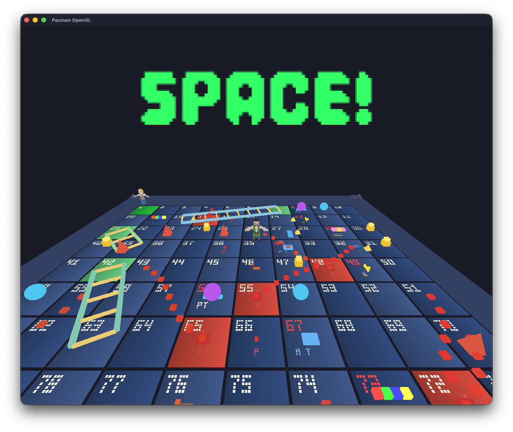

# Snakes and Ladders 3D

A modern 3D implementation of the classic Snakes and Ladders board game built with OpenGL. Experience the traditional board game with enhanced 3D graphics, interactive minigames, and various special tiles that add strategic depth to gameplay.



## 🎥 Demo Video

<video width="800" controls>
  <source src="assets/result/VDO Gameplay/Gameplay.mp4" type="video/mp4">
  Your browser does not support the video tag.
</video>

<div align="center">

[](https://youtu.be/gI_U13uca3M)
[](https://github.com/fastLnwza/Pacman-OpenGL/raw/main/assets/result/VDO%20Gameplay/Gameplay.mp4)

</div>

## 🎮 Overview

This project brings the classic Snakes and Ladders board game to life in a fully 3D environment. Players navigate a 100-tile board, rolling dice to advance while encountering ladders, snakes, minigames, and special tiles that can dramatically change the course of the game.

### Key Features

- **3D Graphics**: Beautiful 3D board with animated player models and physics-based dice rolling
- **Multiplayer Support**: Play with 2-4 players in turn-based gameplay
- **Interactive Minigames**: 5 different skill-based minigames that reward bonus steps
- **Special Tiles**: Various tile types including portals, traps, bonuses, and more
- **Audio System**: Background music and sound effects with real-time volume controls
- **Cross-Platform**: Fully compatible with macOS and Windows

## 🎯 Gameplay

### Basic Rules

1. Players take turns rolling a dice (1-6) and moving forward by the rolled number
2. Land on special tiles to trigger various effects
3. First player to reach tile 100 wins the game
4. You must roll the exact number needed to reach tile 100 (overshooting will bounce back)

### Special Tiles

#### 🪜 Ladders (3 tiles)
Climb up ladders to advance quickly:
- Tile 7 → Tile 18 (+11 steps)
- Tile 21 → Tile 39 (+18 steps)
- Tile 42 → Tile 63 (+21 steps)

#### 🐍 Snakes (9 tiles)
Slide down snakes and move backward:
- Various tiles throughout the board send you back 13-23 steps

#### 🎮 Minigames (10 tiles)
Complete skill-based challenges to earn bonus steps (+6 if successful):
- **Precision Timing**: Stop the timer at exactly 4.99 seconds
- **Memory Game**: Remember and repeat a sequence of numbers (3-4 digits)
- **Reaction Game**: Guess a number between 1-9 before the AI does
- **Math Game**: Solve arithmetic problems within the time limit
- **Pattern Game**: Memorize and repeat a sequence of directional inputs (W, S, A, D)

#### ⚡ Special Activity Tiles

- **Slide** (5 tiles): Move forward 1 additional step
- **Portal** (5 tiles): Teleport to a random tile on the board (ends turn)
- **Trap** (5 tiles): Skip your next turn
- **Bonus** (5 tiles): Receive 1-6 random bonus steps
- **Skip Turn** (3 tiles): Immediately skip your turn
- **Walk Backward** (3 tiles): Move backward 3 steps

## 🎮 Controls

| Key | Action |
|-----|--------|
| **Space** | Roll dice / Confirm minigame actions |
| **+ / -** | Increase / Decrease volume |
| **T** | Toggle debug teleport mode |
| **0-9** | Enter tile number (debug mode) |
| **Enter** | Warp to tile (debug mode) |
| **Backspace** | Delete digit (debug mode) |

### Minigame Controls

- **Precision Timing**: Press Space at the right moment
- **Memory Game**: Type numbers (1-9) to repeat the sequence
- **Reaction Game**: Type a number (1-9) to guess
- **Math Game**: Type the answer and press Space
- **Pattern Game**: Type W, S, A, D keys to repeat the pattern

## 🛠️ Prerequisites

- **CMake** 3.20 or higher
- **C++17** compatible compiler:
  - macOS: Xcode command line tools (`xcode-select --install`)
  - Windows: [Visual Studio 2022](https://visualstudio.microsoft.com/downloads/) with "Desktop development with C++" workload
  - Linux: `g++` or `clang++`

### Optional (for audio support)

- **macOS**: `brew install sdl2_mixer`
- **Windows**: SDL2_mixer will be automatically fetched via CMake

## 📦 Build & Run

### Configure the project

```bash
cmake -S . -B build
```

### Build the executable

```bash
cmake --build build
```

### Run the game

```bash
# macOS / Linux
./build/PacmanOpenGL

# Windows
build\PacmanOpenGL.exe
```

The executable and required assets (shaders, fonts) will be placed in the `build` directory.

## 📁 Project Structure

```
Pacman-OpenGL/
├── src/
│   ├── core/              # Core systems (window, camera, audio)
│   ├── game/              # Game logic
│   │   ├── map/           # Board generation and tile management
│   │   ├── player/        # Player movement and dice mechanics
│   │   ├── minigame/      # All 5 minigame implementations
│   │   ├── menu/          # Main menu system
│   │   └── win/           # Win screen
│   ├── rendering/         # Graphics rendering (shaders, models, textures)
│   └── utils/             # Utility functions
├── assets/
│   ├── character/         # Player 3D models (GLB format)
│   ├── audio/             # Background music and sound effects
│   ├── fonts/             # UI fonts
│   └── result/            # Screenshot assets
├── shaders/               # GLSL vertex and fragment shaders
└── CMakeLists.txt         # Build configuration
```

## 🎨 Technical Details

### Graphics

- **Rendering API**: OpenGL 3.3+ (via GLAD)
- **3D Models**: GLB/GLTF format (player models) and OBJ format (dice)
- **Shaders**: Custom GLSL shaders for rendering
- **Text Rendering**: FreeType for UI text

### Audio

- **Library**: SDL2_mixer
- **Formats**: MP3, OGG, WAV
- **Features**: Background music with volume control, sound effects

### Dependencies

- **GLFW**: Window management and input handling
- **GLAD**: OpenGL function loading
- **GLM**: Mathematics library for 3D operations
- **FreeType**: Font rendering
- **Assimp**: 3D model loading
- **SDL2_mixer**: Audio playback
- **cgltf**: GLTF model parsing

## 🎲 Game Mechanics

### Turn System

1. Player rolls dice (press Space)
2. Dice animates with physics-based rolling
3. Player moves forward by the rolled number
4. If landing on a special tile, the effect is triggered
5. Turn ends and switches to next player

### Tile Priority

When multiple activities exist on the same tile, priority is:
1. Ladders/Snakes (highest)
2. Minigames
3. Skip Turn / Walk Backward
4. Portal
5. Slide
6. Trap
7. Bonus (lowest)

### Win Condition

A player wins by reaching exactly tile 100. Rolling a number that would exceed 100 will cause the player to bounce back from tile 100.

## 🐛 Debug Features

Press **T** to enable debug teleport mode, allowing you to:
- Type a tile number (0-99) and press Enter to instantly warp to that tile
- Test tile effects without playing through the entire game
- Useful for development and testing

## 👥 Credits

### Developers
- **65070501006** Jarukit Pan-Iam
- **65070501034** Nanthikarn Sakulnet

### 3D Models
- **Dice model**: [dice](https://skfb.ly/Ftpp) (Sketchfab)
- **Player models**: [Inuciian](https://sketchfab.com/Inuciian) (Sketchfab)

## 📄 License

This project uses various open-source libraries. Please refer to their respective licenses:
- GLFW (zlib/libpng)
- GLAD (MIT)
- GLM (MIT)
- FreeType (FreeType License)
- Assimp (BSD 3-Clause)
- SDL2_mixer (zlib)

## 🤝 Contributing

This is an academic project. For questions or suggestions, please contact the developers.

---

**Enjoy the game!** 🎲🎮
